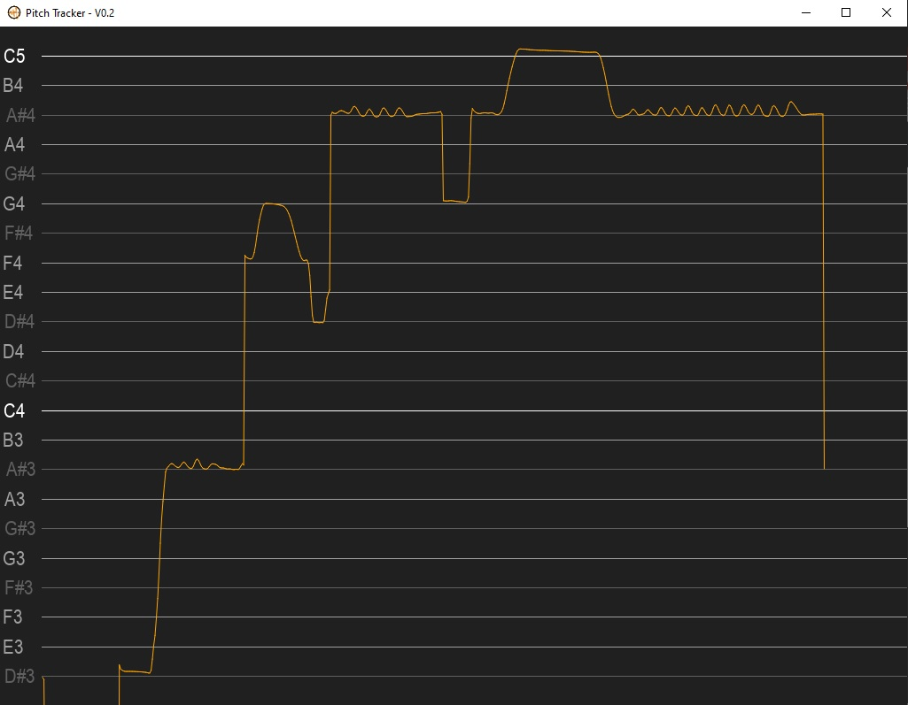

Real-time instrument or vocal pitch tracker - Version 0.2

## What it does

This tool tracks pitch changes of a single instrument over time.
It can be useful for practising vocal intonation, guitar string bends, but it can also be used as a tuner.

## What it doesn't

It can't track multiple notes at once or even detect chords. It doesn't work if there is a lot of background noise.

## Download

[Windows Download](https://www.dropbox.com/s/vslhfspumk18gyu/PitchTracker_V0.2.zip?dl=0)

## Installation

- Extract all files
- Run "PitchTracker.exe"

## Usage

Sing or play into your microphone or audio device. 
If it doesn't work, try changing the device id and silence threshold in the config file.
